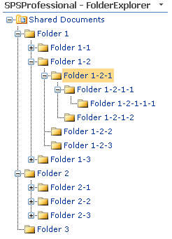
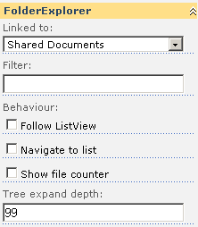
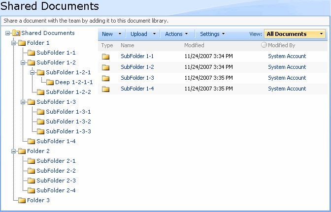
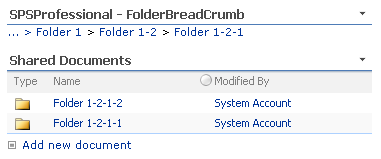
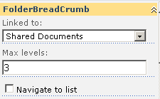

# SPSProfessional.SharePoint.WebParts.Navigation

# FolderExplorer WebPart

This webpart is included in the **SPSProfessional** [Navigation webparts](/page/Navigation-Web-Parts.aspx) package. The webpart generate a tree with the folder structure of a List or Document Library. This provides users with a way to quickly navigate to a desired folder.

Usage
-----

After installing the webpart , it is only necessary to add it in a webpart page and link it to a ListViewer webpart . Then, you will be able to navigate using the folder tree. In the properties you can specify:

**Linked to:** the List View webpart linked to the folder explorer

**Filter:** shows only the specified folders

**Follow ListView:** if a folder is selected in the List View, the same folder is selected in the tree

**Navigate to list:** if checked, the link redirect to the list folder

**Show file counter:** shows the number of files in the folder

**Tree expand depth:** the number of levels to show

Tip
---

Add a folder explorer to any Document Library view and get a “Explorer-like” view

# Folder BreadCrumb WebPart

The webpart shows links indicating the route to the current folder location, providing users a means of indicating their position in a list as well as a "jump-up" to a parent folder.

Usage
-----

After installation, you only need to add the FolderBreadCrumb in a webpart page and link it to a ListViewer webpart; then, you will be able to navigate using the breadcrumb. In the properties is possible to specify the maximum levels to show.

If "Navigate to list" is checked, the links in the breadcrumb redirect to the matching list folder.

# Folder Explorer Feature

 Activating this feature, you will be able to add easily a tree view navigation in each Document Library in order to navigate fast to the desired folder.

  

Usage
-----

To Activate this feature go to "Site Settings", "Site Features" and activate the "**SPSProfessional** Folder Explorer in Actions menu" feature

